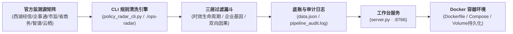

# 云谷中心 · 政策与活动雷达 CLI 自动更新与 Docker 部署标准作业程序 (SOP)

> **编制对象**：云谷中心企服技术运维团队、宋姐企服组及自动化部署人员  
> **适用环境**：本地 macOS / Linux 宿主机 及 生产 Docker 容器化环境  
> **服务终端**：`http://127.0.0.1:8766/?v=2`（外部映射端口支持环境变量定制）

---

## 一、 整体架构与设计原则

本系统专为云谷中心产业园区设计，覆盖在园 130 家企业（70% AI / OPC / 3–20 人小微 / 20–100 人成长）的核心诉求与二期 50,000㎡ 招商去化底盘。通过 **CLI 命令行工具** 与 **容器化常驻调度**，实现政策与公开活动的自动搜集、三层有效性清洗、留痕审计与可视化呈现。



---

## 二、 CLI 工具指令集全景参考 (`./ops-radar`)

系统提供了统一的 CLI 运维工具 [`policy_radar_cli.py`](file:///Users/albert/Documents/project/tmp/fde/ops-console/policy_radar_cli.py)，并附带了快捷 Shell 包装指令 [`./ops-radar`](file:///Users/albert/Documents/project/tmp/fde/ops-console/ops-radar)。

### 1. 核心命令一览

| 命令 | 完整写法 | 核心功能 | 适用场景 |
| :--- | :--- | :--- | :--- |
| **`update`** | `./ops-radar update` | 执行三层漏斗规则引擎，抓取清洗政策与公开活动，更新 `data.json` 并记录审计 | 每日定时更新、录入新政策后手动刷新 |
| **`status`** | `./ops-radar status` | 输出当前雷达条目大盘、渠道分布、生命周期时效分布及最近审计记录 | 运维巡检、排查雷达数据是否陈旧 |
| **`verify`** | `./ops-radar verify` | 严苛校验公文发文字号合法性（带六角括号）、活动真实性与时间字段 | 发布前质检、防幻觉公文拦截 |
| **`events`** | `./ops-radar events` | 专用展示收录的 100% 真实公开活动详情（双碳/GLM补贴/云栖等） | 专员快速提取近期活动对外通知 |
| **`cron`** | `./ops-radar cron` | 静默执行更新入库，仅追加日志不输出多余排版 | Linux Crontab 或容器后台定时唤醒 |
| **`serve`** | `./ops-radar serve --port 8766` | 启动 Web 工作台服务，可自定义监听端口与主机地址 | 本地调试或容器前台主进程 |

### 2. 命令执行示例

```bash
# 1. 立即执行一次全量规则清洗与更新
./ops-radar update

# 2. 查看当前状态看板
./ops-radar status

# 3. 校验发文字号法定性
./ops-radar verify

# 4. 查看当前真实公开活动清单
./ops-radar events
```

---

## 三、 真实公开活动录入与维护规范

为杜绝营销虚假活动，收录公开活动必须属于以下三大硬核类别，且必须具备明确主办方、起止时间与确切场地：

| 活动类别 | 典型收录标准 | 当前已收录代表条目 |
| :--- | :--- | :--- |
| **1. 政策类活动** | 政府发改/经信牵头的“双碳”、绿色低碳、绿色算力与碳排放双控对接会 | • **国家碳达峰试点（杭州）与智算中心节能降碳对接会**（解读算力 PUE<1.2、算电协同与国债节能设备更新 15% 补贴）<br/>• **长三角零碳园区创新发展联盟低碳转型技术对接会**（免费碳盘查与出海欧盟 CBAM 碳关税辅导） |
| **2. 补贴类活动** | 主流大模型原厂或政府针对 Token/算力/房租设立的城市级专项补贴申领活动 | • **“智谱·杭州全城Coding计划” GLM 编程 Token 专项补贴**（个人补贴 51% 打 4.9 折，企业购买补贴 55% 上限 100 万元）<br/>• **西湖区算力券与“Token券”现场申领兑付辅导专场**（经信专员驻场云谷，直报 50% Token 补贴与 100 万算力券） |
| **3. 会议类活动** | 杭州本地具有全球/国家影响力的顶级开发者峰会与高规格博览会 | • **2026 云栖大会**（聚焦 Agentic AI 智能体应用全栈生态，三大主论坛+120场分论坛，云栖小镇/国博）<br/>• **第五届全球数字贸易博览会（数贸会）**（国家级展会，设 AI 大模型与算力底座专区，对接海外采购商） |

---

## 四、 Docker 生产环境容器化部署 SOP

### 1. 配置文件结构
```text
tmp/fde/ops-console/
├── Dockerfile              # 轻量化 Python 3.11 运行环境镜像定义
├── docker-compose.yml      # 一键编排、端口映射与健康检查
├── entrypoint.sh           # 容器入口：初始化更新 -> 后台Cron守护 -> 前台服务
├── .dockerignore           # 构建过滤文件（排除无用缓存与敏感数据）
├── policy_radar_cli.py     # CLI 运维工具核心
├── ops-radar               # CLI 指令快捷包装
├── pipeline_policy_radar.py# 三层漏斗清洗流水线
├── server.py               # HTTP Web 业务中枢
├── data.json               # [挂载卷] 雷达核心数据持久化存储
└── pipeline_audit.log      # [挂载卷] 自动化审计追踪日志
```

### 2. 方式 A：使用 Docker Compose 一键启动（推荐）

```bash
# 1. 切换至项目所在目录
cd /Users/albert/Documents/project/tmp/fde/ops-console

# 2. 构建并后台运行容器
docker compose up -d --build

# 3. 查看容器运行状态与健康检查
docker compose ps

# 4. 查看实时更新与服务日志
docker compose logs -f ops-console
```

### 3. 方式 B：纯 Docker 原生命令构建与运行

```bash
# 1. 构建 Docker 镜像
docker build -t yungu-policy-radar:latest .

# 2. 运行容器（带宿主机文件持久化挂载）
docker run -d \
  --name yungu-policy-radar \
  --restart unless-stopped \
  -p 8766:8766 \
  -e PORT=8766 \
  -e AUTO_CRON=true \
  -v $(pwd)/data.json:/app/data.json \
  -v $(pwd)/pipeline_audit.log:/app/pipeline_audit.log \
  yungu-policy-radar:latest

# 3. 验证容器内健康状态
docker inspect --format='{{json .State.Health.Status}}' yungu-policy-radar
```

### 4. 容器内执行 CLI 维护指令
容器常驻运行期间，若企服专员需要手动触发更新或查看状态，可直接使用 `docker exec`：

```bash
# 查看容器内雷达当前大盘状态
docker exec -it yungu-policy-radar ./ops-radar status

# 强制触发一次三层漏斗全网更新
docker exec -it yungu-policy-radar ./ops-radar update

# 查看容器内已收录的真实公开活动
docker exec -it yungu-policy-radar ./ops-radar events

# 查看容器内公文字号合法性核验
docker exec -it yungu-policy-radar ./ops-radar verify
```

---

## 五、 数据持久化与高可用保证

1. **宿主机持久化卷 (Volumes)**：
   必须确保 `data.json` 与 `pipeline_audit.log` 挂载至宿主机。当容器重建或版本升级时，历史企业比对记录、专员核验确认状态以及审计日志 100% 保留不丢失。
2. **两击熔断与异常排查**：
   若连续两次 CLI 更新报错，系统自动停止覆写 `data.json`，保留上一稳定版本快照，并在 `pipeline_audit.log` 中记录阻断证据。
3. **HTTP 探针健康检查**：
   容器内置健康检查探针：`curl -f http://localhost:8766/?v=2`，间隔 30 秒轮询。一旦服务无响应，Docker 守护进程将自动触发容器健康预警与自愈重启。
