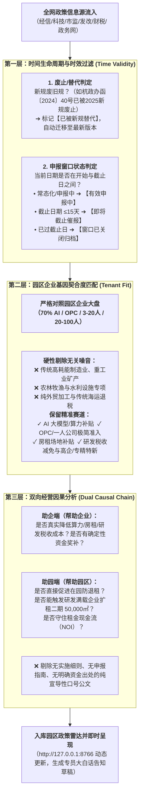

# 园区政策自动搜集与有效性清洗标准作业程序 (SOP)
## ——基于园区真实底盘与生命周期时效的三层过滤机制

> **编制对象**：云谷中心企服运营线（宋姐团队）及 AI 自动化采集工作流  
> **核心原则**：不搞关键词盲目泛搜，以**“在园 130 家企业真实痛点与园区二期去化经营底盘”**为唯一锚点，通过时间生命周期强力清洗，彻底剔除**“已过期的、已过时的、没有用的”**无效信息。

---

## 一、 整体架构与三层漏斗过滤逻辑

政策自动搜集不是简单的网络爬虫，而是基于园区经营因果关系的**“三层漏斗智能判别工作流”**：



---

## 二、 自动化采集源监控矩阵 (Source Matrix)

为杜绝野鸡中介与自媒体假新闻，采集源严格限制在以下**官方公信力发布渠道**：

| 层级 | 监测官方站点 / 平台 | 监控抓取栏目 | 采集频率 | 核心关注公文字号与类型 |
| :--- | :--- | :--- | :--- | :--- |
| **区级属地源** | **西湖区人民政府官网 / 企事通直报平台** | 经信局、科技局、发改局“通知公告”与“申报指南” | 每日早 07:30 | `西经信〔...〕号`、`西科发〔...〕号`（重点抓算力券、模型备案、房租补贴） |
| **市级统筹源** | **杭州市经济和信息化局 / 科技局 / 市场监管局** | “政策法规”、“惠企政策矩阵”、“亲清在线”API | 每日早 07:45 | `杭政办函〔...〕号`、`杭市监〔...〕号`、`杭科高〔...〕号`（重点抓 OPC 举措、新雏鹰、算力大盘） |
| **省级主管部门** | **浙江省经济和信息化厅 / 科技厅** | “数字经济专栏”、“首版次软件申报”、“科技型企业培育” | 每周一/四 | `浙经信软件〔...〕号`、`浙科发高〔...〕号`（重点抓专精特新、首版次软件） |
| **国家财税部委** | **国家税务总局 / 财政部 / 科技部** | “政策法规库”、“税收优惠目录” | 每月 1 日 / 15 日 | `财税〔...〕号`、税总联合公告（重点抓研发费用 100% 加计扣除、高企 15% 优惠） |

---

## 三、 结构化解析字段标准规范 (Schema)

每条采集到的公文必须强制剥离为以下标准 JSON 字段，**缺少发文字号或出处条款的坚决不予入库**：

```json
{
  "id": "唯一标识 (如 rad_xihu_compute_2025)",
  "title": "公文正式标题",
  "doc_no": "正式发文字号（如 西经信〔2025〕10号）",
  "agency": "发文机关（如 西湖区经济和信息化局）",
  "publish_date": "发布日期（YYYY-MM-DD）",
  "window": {
    "type": "申报类型（rolling 常态化 / window 集中窗口）",
    "start_date": "开始日期",
    "end_date": "截止日期",
    "status": "有效状态（active 有效 / expiring 即将截止 / expired 已截止 / superseded 已废止）"
  },
  "lifecycle": {
    "is_latest": true,
    "superseded_by": "新公文 ID（若被废止）",
    "replaces": "旧公文文号（如 杭政办函〔2024〕40号）"
  },
  "hard_criteria": [
    "申报硬门槛 1（如：在西湖区实际办公并缴纳社保）",
    "申报硬门槛 2（如：研发人员占比 ≥ 50%）",
    "申报硬门槛 3（如：通过国家网信办算法备案）"
  ],
  "subsidy_detail": "资金与测算公式（如：最高 50% 补助，单家企业上限 100 万元）",
  "citation": "权威依据原文逐字摘录（用于专员对客抗辩与解释出处）",
  "dual_benefit": {
    "helps_park": "对园区经营的具体助益（如：降低退租概率、推动二期 500㎡ 扩租）",
    "helps_enterprise": "对企业的具体降本助益（如：大模型训练成本减半）"
  },
  "matched_size_bands": ["opc", "s_3_20", "m_20_100"]
}
```

---

## 四、 每日自动化运行流程 (Daily Workflow SOP)

```text
[阶段 1：早间定时触发与比对 (08:00)]
  1. 系统定时唤醒 `pipeline_policy_radar.py`；
  2. 遍历官方数据源抓取最新更新列表；
  3. 比对本地公文库哈希值，识别新增公文与修改公文。

[阶段 2：三层漏斗规则引擎过滤]
  4. 【时效清洗】：检查截止日期与前置废止条款；
     - 若已过截止日 ➔ 状态置为 `expired`（窗口已关闭）；
     - 若被新规废止 ➔ 状态置为 `superseded`，提示“已被某文替代”；
  5. 【基因清洗】：提取关键词向量与受众特征，与在园企业标签对碰，剔除无关制造业/外贸公文；
  6. 【因果清洗】：测算对在园 130 家企业租金、算力、税收是否有可落地的量化收益，剔除虚浮公文。

[阶段 3：在园企业动态三态匹配 (Match Matrix)]
  7. 扫描在园 130 家脱敏底账：
     - 字段完全达标 ➔ 判定为【符合】；
     - 缺少关键字段（如社保在册人数待补、承租面积待确认） ➔ 判定为【待核验】并标出缺口（Gap）；
     - 规模或赛道不符 ➔ 判定为【排除】。

[阶段 4：持久化与呈现更新 (08:05)]
  8. 写入 `data.json` 并记录 `pipeline_audit.log`；
  9. 热重载通知本地前端 `http://127.0.0.1:8766`，企服专员上班即可直接在工作台查看最新有效待办任务。
```

---

## 五、 异常处置与防幻觉红线 (Guardrails)

1. **红线 1：无正规发文字号坚决不入库**  
   任何微信公众号、中介中转文章提及但未找到正式政府公文文号（如“某发〔202X〕X号”）的，一律拦截，不得进入主推荐雷达。
2. **红线 2：新规废止旧规自动预警**  
   一旦检测到如《杭州市加快建设人工智能创新高地实施方案（2025年版）》正式印发并宣布废止《杭政办函〔2024〕40号》，系统必须**立即将旧规标记为“已废止”，并自动将旧项目迁移关联至新规**，严禁专员拿失效旧文件对外指导。
3. **红线 3：专员人工复核放行制（专员终审）**  
   AI 初筛标记为“符合”的项目，系统只出具草稿建议，必须由企服专员人工电话/当面复核企业真实凭证后，点击【确认放行】，文案中强制带有“申报成功≠资金到账”抗辩条款，杜绝园区法律纠纷。
