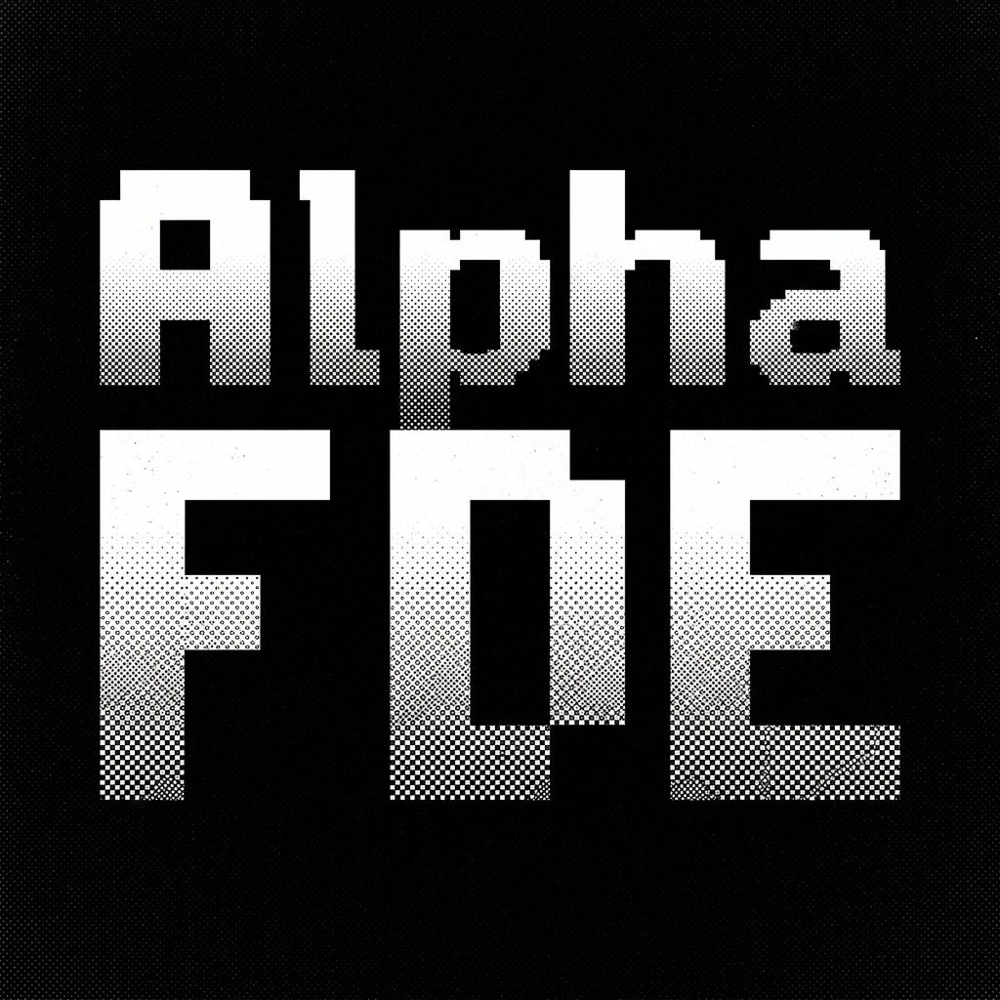
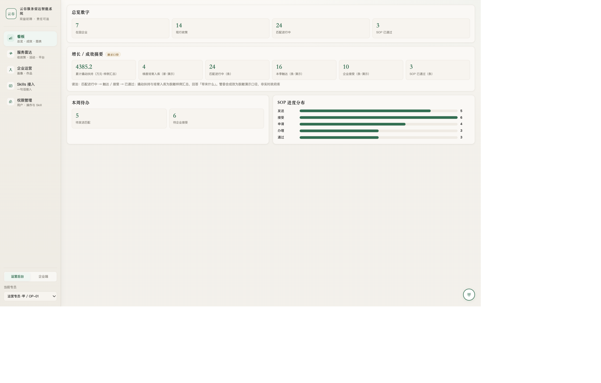
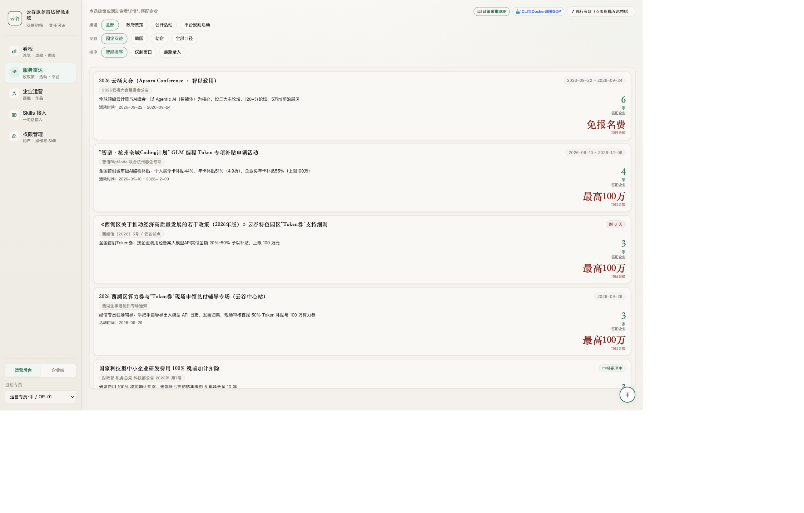
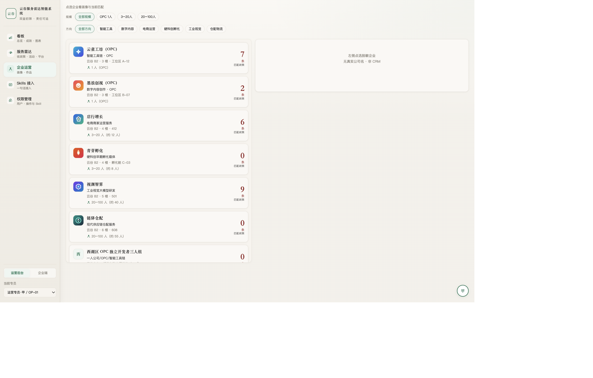
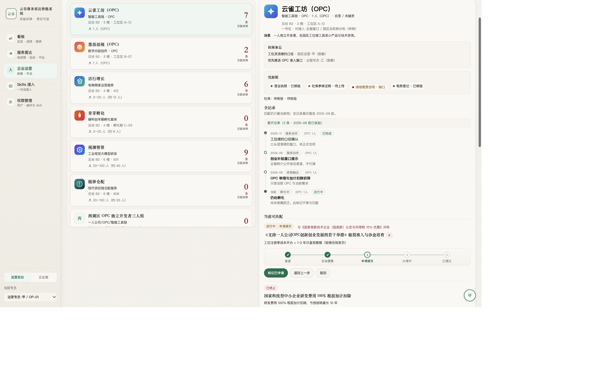
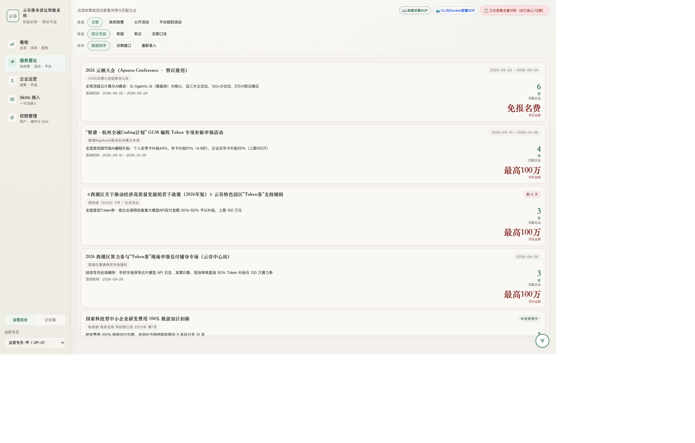
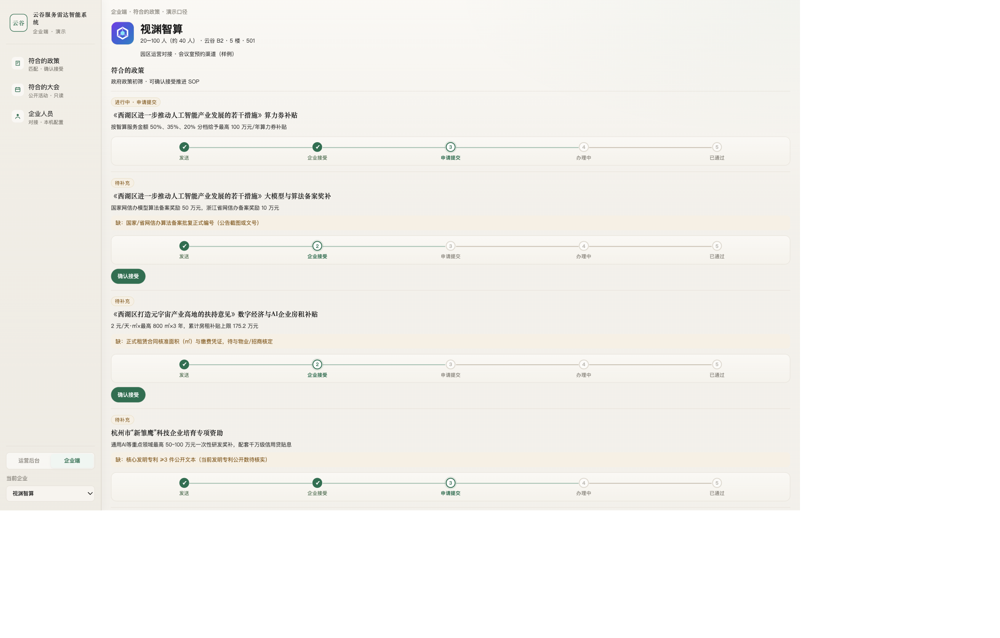
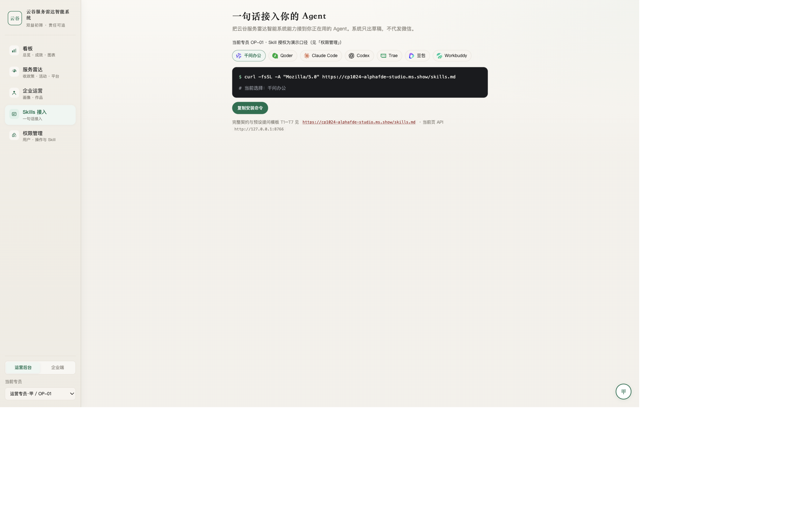

# 云谷企服雷达智能匹配系统 · AlphaFDE Studio

<div align="center">



**面向科技园区与孵化器的 AI 政策申报与企业服务管家**

[](https://www.typescriptlang.org)
[](https://nodejs.org)
[](https://sqlite.org)
[](https://docker.com)
[](https://modelscope.cn/studios/cp1024/AlphaFDE-Studio)
[](LICENSE)

[🌐 在线演示 (直连)](https://cp1024-alphafde-studio.ms.show/) · [🚀 魔搭创空间](https://modelscope.cn/studios/cp1024/AlphaFDE-Studio) · [🤖 Agent Skills](https://cp1024-alphafde-studio.ms.show/skills.md)

</div>

---

## 📌 系统定位与核心价值

在 **3 人企服编制** 现实下，传统园区面临“政策零散翻不全、企业条件对不上、申报时限常错过、进度分散难留痕”四大痛点。

**云谷企服雷达智能匹配系统** 将政策辅导与企业服务重构为一条高可靠流水线：
$$\text{企服雷达初筛} \longrightarrow \text{三态判定（符合/排除/待核验）} \longrightarrow \text{专员放行} \longrightarrow \text{微信草稿触达} \longrightarrow \text{SOP 留痕}$$

* **真实底账与出处**：立足在园企业底账，100% 绑定官方公文与权威通知出处（Citation），绝不凭空编造。
* **双向精准匹配**：既支持「为企业体检找政策」，也支持在申报截止临近时「反向锁定适企优先触达」。
* **专员人机闭环**：坚守合规底线，系统不代发微信、不代窗口申报，专员复核后一键生成得体触达话术。

---

## 🖼️ 系统全景截图

### 1. 运营看板总览
实时汇总在园企业底账、现行有效政策、待核验匹配项及临近截止警报。


### 2. 6 大通道企服雷达
覆盖「政府政策、公开活动、平台规则、阿里服务、园区服务、机构服务」，倒计时自动预警（红·紧急 ≤14天 / 黄·关注 ≤45天 / 绿·充裕）。


### 3. 企业运营与全景底账
收录 OPC 一人公司、小微成长企业与规上研发企业画像，展示多源确认状态与材料缺口（Gap）。


### 4. 企业详情与 5 步 SOP 推进
标准化办理闭环（发送 → 企业接受 → 申请提交 → 办理中 → 已通过），动作实时审计落盘。


### 5. 政策详情与权威出处
精准条款拆解、申报材料清单与官方红头文件核验依据。


### 6. 企业自主服务门户
面向入驻企业开放的自查门户，清晰掌握专属权益、匹配政策与活动日历。


### 7. Agent Skills 智能体接入
原生提供标准化 OpenAPI 与 7 套即插即用提问模板（T1–T7），供各大主流 AI Agent 零门槛挂载。


---

## 🏗️ 全栈 TypeScript + 嵌入式 SQLite 架构

系统已全面完成 **TypeScript 生产级工程重构**：

* **生产级 TypeScript 后端 (`src/server.ts`, `src/services/`, `src/repositories/`)**：
  - 基于 Node.js 原生 HTTP 与内置 SQLite（`node:sqlite`），零沉重第三方框架包袱。
  - 严密类型契约（Schema & API Types），规范 Policy、Company、Match、SOP 状态机生命周期。
  - 关系型数据持久化：内置 `schema.sql`、事务管理与审计日志表（`sop_logs`、`confirm_logs`）。
* **浏览器内嵌轻量 SQLite（WASM / `src/client/alpha_db.ts`）**：
  - 前端客户端同样采用 TypeScript 模块化编写，支持双击 `index.html` 纯静态秒开。
  - 专员全流程操作通过 `LocalStorage / IndexedDB` 自动本地落盘，提供一键导出 `.db` 数据库。
* **TypeScript CLI 终端工具 (`src/cli.ts`)**：
  - 支持 `node dist/cli.js list`（雷达扫描）、`node dist/cli.js match <id>`（企业匹配）及 `node dist/cli.js stats`（大盘统计）。

---

## ⚡ 快速使用与部署

### 方式一：TypeScript 服务启动（开发与生产）
```bash
# 1. 安装依赖并编译
npm install
npm run build

# 2. 启动服务 (默认端口 8766 / 7860)
npm start

# 3. 运行全链路单元与集成测试
npm test
```

### 方式二：纯前端静态离线秒开（零后端模式）
无需任何后台服务，双击 `index.html` 或部署到 GitHub Pages 即可直接在浏览器内由 SQLite 引擎驱动运行！

### 方式三：Docker 容器化部署
```bash
docker compose up -d --build
# 服务监听端口 8766 (或 7860)
```

### 方式四：向任意 AI Agent 挂载本技能
```bash
# 复制以下指令喂给 Claude Code / Qwen / DeepSeek / Trae / Cursor：
curl -fsSL -A "Mozilla/5.0" https://cp1024-alphafde-studio.ms.show/skills.md
```

---

## 🛡️ 安全与合规红线

- ❌ **严禁读取私人通讯**：不越权扫描私人微信聊天，仅处理公开政策与企业授权登记底账。
- ❌ **严禁静默代发微信**：系统仅生成触达建议草稿，必须由园区专员人机确认（Human-in-the-loop）后发送。
- ❌ **严禁代做窗口申报**：系统定位于辅导与穿透，不替代政府法定申领系统，不做“包过”虚假承诺。
- ✅ **真实权威核验**：每条入库政策与活动必须有可靠发文凭据，过期条目自动下架隐藏。

---

## 📄 开源与商业支持

本项目遵循 [Apache-2.0 License](LICENSE) 开源。  
如需企业私有化部署、高阶政策抓取流水线与定制企服协同对接，欢迎联系云谷企服技术小组。
